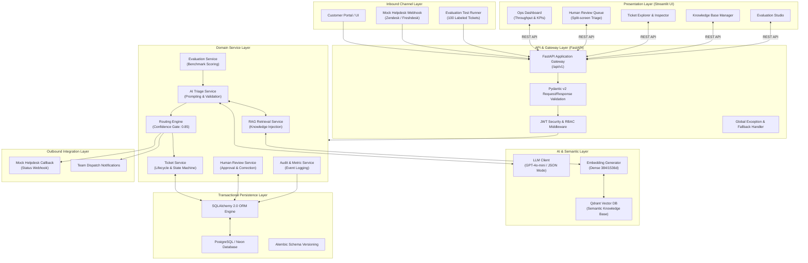
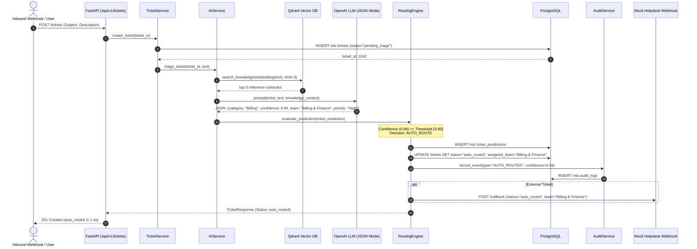
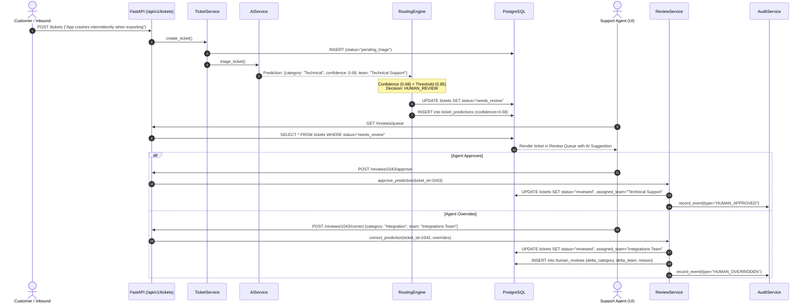

# CloudDesk — System Architecture Document

**Document Version:** 1.0.0  
**Project:** CloudDesk — AI-Assisted Support Ticket Triage & Routing Platform  
**Target Audience:** Software Engineers, Forward-Deployed Engineers (FDE), DevOps, System Architects  
**Status:** Approved for Implementation  

---

## 1. Architectural Philosophy & Design Principles

CloudDesk is architected around four non-negotiable engineering principles designed to meet enterprise B2B support operations standards:

1. **Deterministic Guardrails Around Probabilistic AI:** Large Language Models are inherently non-deterministic. CloudDesk treats the LLM strictly as an inference engine whose outputs must pass through rigorous schema validation (Pydantic), bounded category enums, and a deterministic confidence threshold engine before any business action or database mutation occurs.
2. **Graceful Degradation Over System Halts:** If an external dependency (OpenAI API, Qdrant vector database) becomes slow, throttled, or unreachable, the system must never crash or drop inbound tickets. Tickets must safely persist to relational storage and divert to human oversight queues with explicit degradation reason tags.
3. **Traceability & Complete Observability:** Every decision—whether automated by AI at $\ge 0.85$ confidence or overridden by a human agent—must generate an unalterable audit log capturing prompt versions, raw responses, confidence scores, latency, and agent deltas.
4. **Integration-First Modular Boundary:** Support platforms rarely exist in isolation. CloudDesk is engineered with clean integration boundaries (REST webhooks in and out) simulating real-world helpdesks (Zendesk, Freshdesk, ServiceNow) without coupling core triage logic to external vendor schemas.

---

## 2. End-to-End System Architecture



---

## 3. Subsystem Decomposition & Layered Responsibilities

### 3.1 Presentation Layer: Streamlit Operations Dashboard
* **Architecture:** Python-native reactive frontend communicating strictly over HTTP REST with the FastAPI gateway. No direct database or LLM connections exist in the frontend layer.
* **Key Modules:**
  * `1_Dashboard.py`: Real-time KPI summary (Classification Accuracy, Triage Latency, Auto-Route %, Review Queue Depth, Urgent Alert Banner).
  * `2_Tickets.py`: Full ticket inventory with dynamic status filters (`all`, `pending_triage`, `auto_routed`, `needs_review`, `resolved`).
  * `3_Review_Queue.py`: Specialized human-in-the-loop review station with side-by-side ticket text, AI confidence meters, suggested categories, and single-click override controls.
  * `4_Knowledge_Base.py`: RAG article uploader, vector chunk browser, and semantic search query tester.
  * `5_Evaluation.py`: 100-ticket benchmark execution interface with confusion matrices, latency histograms, and recall scores.
  * `6_Settings.py`: Runtime configuration of confidence threshold ($\theta$), LLM model selection, and mock webhook URLs.

### 3.2 Transport & Gateway Layer: FastAPI
* **Versioned Routing:** All public routes originate under `/api/v1`.
* **Request Validation:** Every payload is validated against strict Pydantic schemas before reaching business logic.
* **Authentication & RBAC:** Dependency injection via `get_current_user` enforces JWT token validation and role checks (`ADMIN`, `TEAM_LEAD`, `AGENT`).
* **CORS & Middleware:** Configured for cross-origin local and cloud communication with structured request ID tracking.

### 3.3 Domain Service Layer
* **`TicketService`:** Enforces ticket state transitions (`pending_triage` $\rightarrow$ `auto_routed` | `needs_review` $\rightarrow$ `reviewed` $\rightarrow$ `in_progress` $\rightarrow$ `resolved`).
* **`AIService`:** Formulates prompt templates, embeds RAG context, calls the LLM with forced JSON schema, and validates the response object.
* **`RoutingEngine`:** Implements deterministic confidence gating:
  $$\text{Action} = \begin{cases} \text{Auto-Route to Department}, & \text{if } \text{confidence} \ge \theta \text{ and valid} \\ \text{Divert to Review Queue}, & \text{if } \text{confidence} < \theta \text{ or failure} \end{cases}$$
* **`ReviewService`:** Manages human agent interactions in the review queue, tracking differences between original AI predictions and human corrections.
* **`RAGService`:** Manages chunking, vector generation, and Qdrant similarity searches to ground ticket triage in company knowledge.
* **`AuditService`:** Generates append-only logs for compliance, analytics, and model fine-tuning feedback loops.
* **`EvaluationService`:** Ingests the 100-ticket ground truth dataset, executes batch inference, and computes confusion matrices, accuracy, precision, recall, and triage latency.

### 3.4 AI & Semantic Vector Layer
* **LLM Engine:** OpenAI `gpt-4o-mini` (or Ollama/local LLM in disconnected environments) configured with `temperature=0.0` for maximum classification reproducibility.
* **Embedding Model:** `text-embedding-3-small` (1536-dimensional) or `sentence-transformers/all-MiniLM-L6-v2` (384-dimensional).
* **Qdrant Vector DB:** Stores vector embeddings of support runbooks, billing policies, API documentation, and historical resolved tickets.

### 3.5 Persistence Layer
* **Relational Store:** PostgreSQL (Neon Cloud or local Docker).
* **ORM:** SQLAlchemy 2.0 using typed declarative models and session dependency injection.
* **Schema Evolution:** Managed via Alembic migration versions.

---

## 4. Primary Data Flows & Sequence Diagrams

### 4.1 Inbound Automated Triage Flow (High-Confidence Case)



### 4.2 Low-Confidence Escalation & Human Review Flow



---

## 5. Resilience, Failure Modes & Circuit Breaking

| Failure Mode | Root Cause | Impact | Mitigation & Fallback Strategy |
| :--- | :--- | :--- | :--- |
| **LLM Outage / 503** | OpenAI API outage or major network partition | AI triage cannot compute classification | **Circuit Breaker:** Request times out after 8s; system catches exception, logs critical warning, updates ticket status to `needs_review` with reason `"AI Service Offline"`. Ticket is never lost. |
| **LLM Rate Limiting (429)** | Exceeded TPM / RPM quota on API tier | Transient API rejection | **Exponential Backoff:** Up to 2 retries with jitter ($200\text{ms} \rightarrow 800\text{ms}$). If still 429, fall back immediately to `needs_review` queue. |
| **Malformed Structured Output** | Model outputs non-JSON or invalid enum value | Pydantic validation fails | **Self-Correction & Retry:** Execute 1 retry with explicit feedback: `"Previous output invalid: [error]. Respond strictly in valid JSON"`. If second attempt fails, divert to `needs_review`. |
| **Qdrant Vector DB Down** | Container restart or vector cluster timeout | Semantic knowledge retrieval unavailable | **Graceful Degradation:** Triage continues without RAG context. LLM prompt is executed with pure ticket text. Incident is logged. |
| **PostgreSQL Connection Spike** | Burst of 200 concurrent incoming webhook calls | Database connection pool exhaustion | **Connection Pooling:** SQLAlchemy `QueuePool` configured with `pool_size=20`, `max_overflow=30`, `pool_timeout=15s`. FastAPI rejects with 503 instead of crashing. |

---

## 6. Infrastructure & Deployment Topology

### 6.1 Local Development (Docker Compose)
For local testing and portfolio demonstrations, all core services are orchestrated via `docker-compose.yml`:
* `backend`: FastAPI app running on port `8000`.
* `frontend`: Streamlit app running on port `8501`.
* `postgres`: PostgreSQL 16 container running on port `5432`.
* `qdrant`: Qdrant vector database running on port `6333`.

```text
[Host Machine Browser]
   │
   ├── Port 8501 ──► [Streamlit Container]
   │                         │
   │                    (REST API)
   │                         ▼
   ├── Port 8000 ──► [FastAPI Container]
                             │
            ┌────────────────┴────────────────┐
            ▼                                 ▼
   [PostgreSQL Container]           [Qdrant Container]
       (Port 5432)                      (Port 6333)
```

### 6.2 Production Cloud Topology (Azure Cloud / AZ-900 Target)
In line with the project's Azure certification alignment:
* **Compute:** Azure Container Apps (serverless, auto-scaling containers for FastAPI backend and Streamlit frontend).
* **Relational Database:** Azure Database for PostgreSQL (Flexible Server) or Neon Serverless PostgreSQL.
* **Vector Store:** Qdrant Cloud cluster or Azure Container App with persistent volume.
* **Secrets:** Azure Key Vault for storage of `OPENAI_API_KEY`, database credentials, and JWT signing keys.
* **Monitoring:** Azure Application Insights & Log Analytics.
