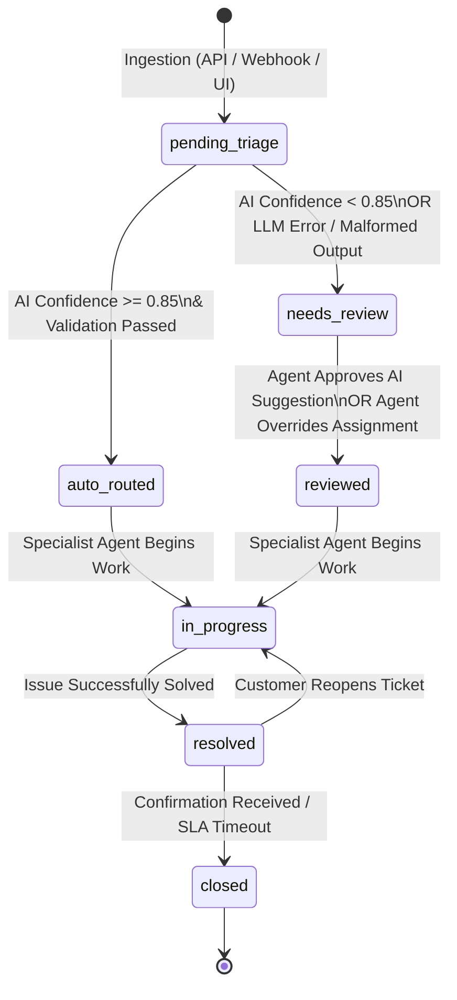
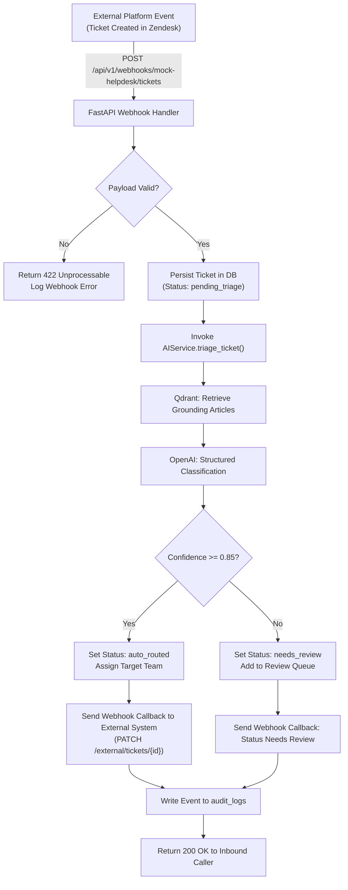
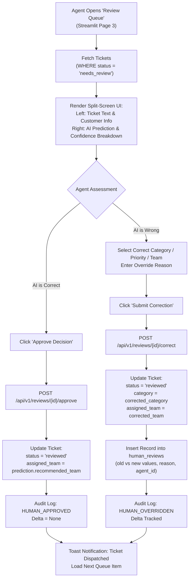
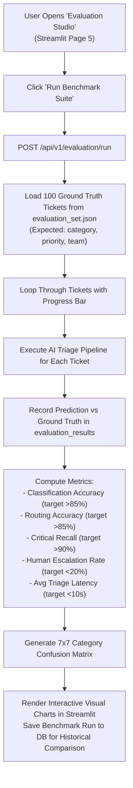

# CloudDesk — Application Flow & State Machine Document

**Document Version:** 1.0.0  
**Project:** CloudDesk — AI-Assisted Support Ticket Triage & Routing Platform  
**Target Audience:** Frontend Developers, Backend Engineers, QA Engineers, Support Ops  
**Status:** Approved for Implementation  

---

## 1. Ticket Lifecycle & State Machine

Every ticket moving through CloudDesk is governed by a finite state machine with strict transition guards.



### 1.1 State Definitions & Valid Transitions

| State Name | Description | Allowed Next States | Trigger / Guard Condition |
| :--- | :--- | :--- | :--- |
| `pending_triage` | Ticket ingested; queued for AI inference. | `auto_routed`, `needs_review` | Triage pipeline executes; confidence score compared to threshold ($\theta = 0.85$). |
| `auto_routed` | High-confidence AI triage; assigned directly to department queue. | `in_progress`, `needs_review` | Confidence $\ge 0.85$. (Can be manually diverted back to review if agent detects error). |
| `needs_review` | Low-confidence AI triage or AI processing failure; placed in Review Queue. | `reviewed` | Assigned human agent takes review action (Approve or Override). |
| `reviewed` | Human agent has verified or corrected category, priority, and team. | `in_progress` | Department specialist assigns ticket to self and initiates resolution. |
| `in_progress` | Department agent actively investigating or communicating with customer. | `resolved`, `needs_review` | Agent submits resolution note or requests re-triage. |
| `resolved` | Customer issue addressed and proposed solution submitted. | `closed`, `in_progress` | Ticket closes after 48h idle or reopens on customer reply. |
| `closed` | Final terminal state; immutable historical record. | None | SLA lifecycle completion. |

---

## 2. End-to-End Application Workflows

### 2.1 Flow 1: Automated Ingestion via External Helpdesk Webhook

This flow represents integration with third-party support platforms (Zendesk, Freshdesk, Intercom).



---

### 2.2 Flow 2: Human-in-the-Loop Review & Override Workflow

When confidence drops below 0.85, the human review workflow safeguards system integrity.



---

### 2.3 Flow 3: Knowledge Base (RAG) Document Ingestion & Query Flow

To enable grounded triage explanations and suggested troubleshooting steps, support documentation is vectorized into Qdrant.

```mermaid
flowchart TD
    subgraph Ingestion["Knowledge Ingestion Flow"]
        K1["Admin Uploads Markdown / Text Doc\n(e.g., Billing Runbook, API Docs)"] --> K2["POST /api/v1/knowledge/upload"]
        K2 --> K3["Recursive Text Splitter\n(Chunk Size: 500 tokens, Overlap: 50)"]
        K3 --> K4["Embedding Model\n(text-embedding-3-small)"]
        K4 --> K5["Upsert Vectors & Payloads into Qdrant\n(Collection: 'support_knowledge')"]
        K5 --> K6["Persist Document Metadata in PostgreSQL\n(table: knowledge_documents)"]
    end

    subgraph Query["Runtime Retrieval Flow"]
        Q1["Inbound Ticket Arrives"] --> Q2["AIService generates ticket embedding"]
        Q2 --> Q3["Qdrant Vector Search\n(Cosine Similarity, limit=3, score >= 0.70)"]
        Q3 --> Q4["Inject Retrieved Chunks into LLM Prompt Context"]
        Q4 --> Q5["LLM generates grounded 'reason' & 'suggested_resolution'"]
    end
```



---

### 2.4 Flow 4: Evaluation Benchmark Workflow (100 Labeled Tickets)

To satisfy the core case study requirement, the evaluation workflow provides measurable proof of system accuracy.



---

## 3. UI Navigation & Page Flow

The Streamlit frontend provides seamless routing across operational workflows:

```text
Streamlit Main App (app.py)
│
├── 1_Dashboard.py (Executive View)
│   ├── KPI Summary Metric Cards (Accuracy, Latency, Escalation %, Auto-Route %)
│   ├── Urgent Tickets Warning Banner (Immediate triage alerts)
│   ├── 24-Hour Throughput & Volume Area Chart
│   └── Category Distribution Donut Chart
│
├── 2_Tickets.py (Ticket Inventory)
│   ├── Filter Toolbar (Status pills, Category dropdown, Search bar)
│   ├── Data Grid (Paginated ticket list with status badges and confidence chips)
│   └── Ticket Detail Drawer (Full description, AI reasoning, audit timeline)
│
├── 3_Review_Queue.py (Agent Workstation)
│   ├── Active Review Count Badge
│   ├── Priority-Sorted Review Cards
│   ├── Split Screen: Raw Customer Context vs AI Assessment
│   └── Action Bar: [1-Click Approve] | [Custom Override Form]
│
├── 4_Knowledge_Base.py (RAG Runbooks)
│   ├── Document Upload Drag & Drop
│   ├── Document Catalog & Vector Chunk Explorer
│   └── Semantic Search Simulator (Test retrieval against query text)
│
├── 5_Evaluation.py (Model Benchmarking)
│   ├── 100-Ticket Test Suite Trigger Button
│   ├── Benchmark Scorecard (Accuracy, Recall, Precision, Latency)
│   ├── Heatmap Confusion Matrix (Predictions vs Labels)
│   └── Error Analysis Drill-Down (Inspect misclassified tickets)
│
└── 6_Settings.py (System Administration)
    ├── Confidence Threshold Slider (0.70 – 0.95, default 0.85)
    ├── Model Selector (GPT-4o-mini / Local LLM)
    └── Mock Webhook Endpoint Tester
```
