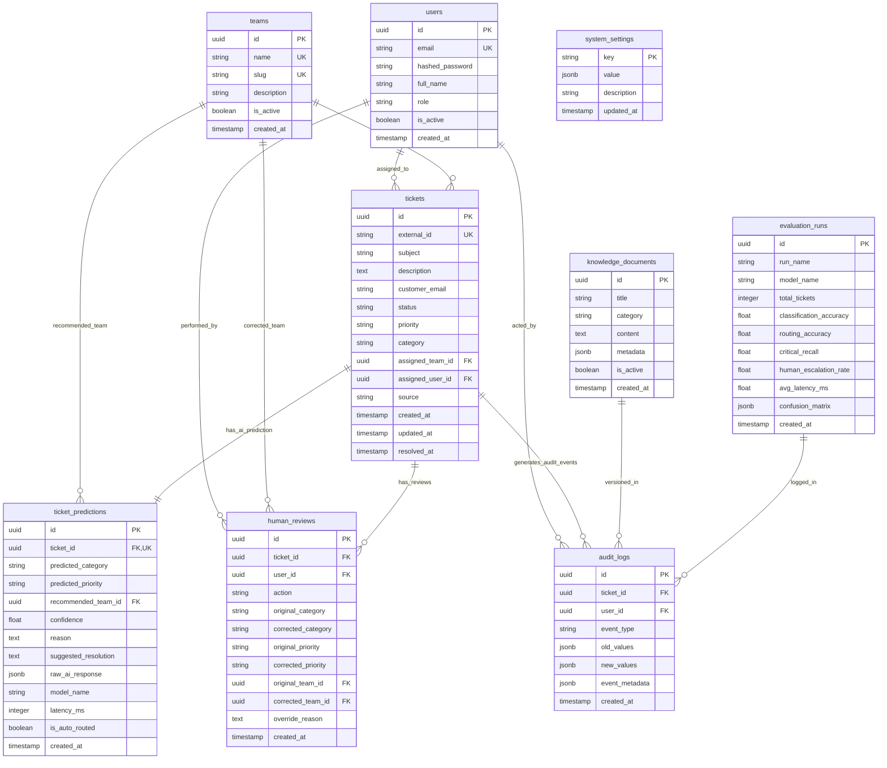

# CloudDesk — Database Schema Specification

**Document Version:** 1.0.0  
**Project:** CloudDesk — AI-Assisted Support Ticket Triage & Routing Platform  
**Target Database:** PostgreSQL 16+ (Neon Cloud / Local Docker) & Qdrant Vector Engine  
**Status:** Approved for Implementation  

---

## 1. Entity-Relationship Overview

The CloudDesk transactional data model is designed to support high-velocity ticket ingestion, strict auditability, human-in-the-loop overrides, and evaluation benchmarking.



---

## 2. PostgreSQL Relational Table Specifications

### 2.1 Table: `users`
Stores user identities, credentials, and role assignments for agents and managers.

| Column | Type | Constraints | Description |
| :--- | :--- | :--- | :--- |
| `id` | `UUID` | `PRIMARY KEY, DEFAULT gen_random_uuid()` | Unique user identifier. |
| `email` | `VARCHAR(255)` | `UNIQUE, NOT NULL` | Login email address. |
| `hashed_password` | `VARCHAR(255)` | `NOT NULL` | Bcrypt hashed password. |
| `full_name` | `VARCHAR(100)` | `NOT NULL` | Agent or admin display name. |
| `role` | `VARCHAR(30)` | `NOT NULL, DEFAULT 'AGENT'` | `ADMIN`, `TEAM_LEAD`, or `AGENT`. |
| `is_active` | `BOOLEAN` | `NOT NULL, DEFAULT TRUE` | Active account toggle. |
| `created_at` | `TIMESTAMPTZ` | `NOT NULL, DEFAULT NOW()` | Record creation timestamp. |
| `updated_at` | `TIMESTAMPTZ` | `NOT NULL, DEFAULT NOW()` | Last update timestamp. |

*Indexes:*
* `ix_users_email` (UNIQUE)

---

### 2.2 Table: `teams`
Represents the functional departments handling support issues.

| Column | Type | Constraints | Description |
| :--- | :--- | :--- | :--- |
| `id` | `UUID` | `PRIMARY KEY, DEFAULT gen_random_uuid()` | Unique team identifier. |
| `name` | `VARCHAR(100)` | `UNIQUE, NOT NULL` | Display name (e.g., `Technical Support`). |
| `slug` | `VARCHAR(50)` | `UNIQUE, NOT NULL` | URL/routing slug (e.g., `technical-support`). |
| `description` | `TEXT` | `NULL` | Department scope and charter. |
| `is_active` | `BOOLEAN` | `NOT NULL, DEFAULT TRUE` | Active status for ticket routing. |
| `created_at` | `TIMESTAMPTZ` | `NOT NULL, DEFAULT NOW()` | Creation timestamp. |

*Initial Seed Records:*
* `Technical Support` (`technical-support`)
* `Billing & Finance` (`billing-finance`)
* `Account Management` (`account-management`)
* `Security & Compliance` (`security-compliance`)
* `Integrations Team` (`integrations-team`)
* `Tier 1 Support` (`tier-1-support`)

---

### 2.3 Table: `tickets`
The central domain entity representing an inbound customer support inquiry.

| Column | Type | Constraints | Description |
| :--- | :--- | :--- | :--- |
| `id` | `UUID` | `PRIMARY KEY, DEFAULT gen_random_uuid()` | Unique ticket identifier. |
| `external_id` | `VARCHAR(100)` | `UNIQUE, NULL` | External helpdesk reference ID (e.g., `ZD-98214`). |
| `subject` | `VARCHAR(255)` | `NOT NULL` | Ticket headline/subject. |
| `description` | `TEXT` | `NOT NULL` | Full issue body from customer. |
| `customer_email` | `VARCHAR(255)` | `NOT NULL` | Customer contact email. |
| `customer_name` | `VARCHAR(100)` | `NULL` | Customer contact name. |
| `status` | `VARCHAR(30)` | `NOT NULL, DEFAULT 'pending_triage'` | `pending_triage`, `auto_routed`, `needs_review`, `reviewed`, `in_progress`, `resolved`, `closed`. |
| `priority` | `VARCHAR(20)` | `NOT NULL, DEFAULT 'Medium'` | `Low`, `Medium`, `High`, `Critical`. |
| `category` | `VARCHAR(50)` | `NULL` | Assigned category (1 of 7 enums). |
| `assigned_team_id` | `UUID` | `FOREIGN KEY (teams.id), NULL` | Department currently handling the ticket. |
| `assigned_user_id` | `UUID` | `FOREIGN KEY (users.id), NULL` | Individual agent assigned to resolve. |
| `source` | `VARCHAR(30)` | `NOT NULL, DEFAULT 'portal'` | `portal`, `webhook`, `email`, `api`. |
| `created_at` | `TIMESTAMPTZ` | `NOT NULL, DEFAULT NOW()` | Ingestion timestamp. |
| `updated_at` | `TIMESTAMPTZ` | `NOT NULL, DEFAULT NOW()` | Status update timestamp. |
| `resolved_at` | `TIMESTAMPTZ` | `NULL` | Resolution completion timestamp. |

*Indexes:*
* `ix_tickets_status` (`status`) — High-frequency queue filtering.
* `ix_tickets_assigned_team` (`assigned_team_id`) — Departmental queue lookups.
* `ix_tickets_created_at` (`created_at DESC`) — Chronological sorting.

---

### 2.4 Table: `ticket_predictions`
Stores the structured AI inference result, model parameters, and confidence scores.

| Column | Type | Constraints | Description |
| :--- | :--- | :--- | :--- |
| `id` | `UUID` | `PRIMARY KEY, DEFAULT gen_random_uuid()` | Unique prediction identifier. |
| `ticket_id` | `UUID` | `FOREIGN KEY (tickets.id) ON DELETE CASCADE, UNIQUE, NOT NULL` | 1-to-1 link to ticket record. |
| `predicted_category`| `VARCHAR(50)` | `NOT NULL` | AI predicted category. |
| `predicted_priority`| `VARCHAR(20)` | `NOT NULL` | AI assessed priority. |
| `recommended_team_id`| `UUID` | `FOREIGN KEY (teams.id), NOT NULL` | Target team determined by AI. |
| `confidence` | `NUMERIC(4,3)` | `NOT NULL` | Confidence score between `0.000` and `1.000`. |
| `reason` | `TEXT` | `NOT NULL` | Concise AI reasoning summary. |
| `suggested_resolution`| `TEXT` | `NULL` | Suggested troubleshooting steps. |
| `raw_ai_response` | `JSONB` | `NOT NULL` | Raw JSON response received from LLM. |
| `model_name` | `VARCHAR(50)` | `NOT NULL` | Model used (e.g., `gpt-4o-mini`). |
| `prompt_tokens` | `INTEGER` | `NULL` | Token usage for input prompt. |
| `completion_tokens` | `INTEGER` | `NULL` | Token usage for response. |
| `latency_ms` | `INTEGER` | `NOT NULL` | Model round-trip latency in milliseconds. |
| `is_auto_routed` | `BOOLEAN` | `NOT NULL` | `True` if confidence $\ge \theta$, `False` if diverted to human review. |
| `created_at` | `TIMESTAMPTZ` | `NOT NULL, DEFAULT NOW()` | Prediction generation timestamp. |

*Indexes:*
* `ix_ticket_predictions_ticket_id` (UNIQUE)
* `ix_ticket_predictions_confidence` (`confidence`)

---

### 2.5 Table: `human_reviews`
Maintains the complete record of human interaction with low-confidence or escalated tickets.

| Column | Type | Constraints | Description |
| :--- | :--- | :--- | :--- |
| `id` | `UUID` | `PRIMARY KEY, DEFAULT gen_random_uuid()` | Unique review action ID. |
| `ticket_id` | `UUID` | `FOREIGN KEY (tickets.id) ON DELETE CASCADE, NOT NULL` | Associated ticket. |
| `user_id` | `UUID` | `FOREIGN KEY (users.id), NOT NULL` | Agent who performed the review. |
| `action` | `VARCHAR(20)` | `NOT NULL` | `approved` or `overridden`. |
| `original_category` | `VARCHAR(50)` | `NOT NULL` | Category suggested by AI. |
| `corrected_category`| `VARCHAR(50)` | `NOT NULL` | Category chosen by agent. |
| `original_priority` | `VARCHAR(20)` | `NOT NULL` | Priority suggested by AI. |
| `corrected_priority`| `VARCHAR(20)` | `NOT NULL` | Priority chosen by agent. |
| `original_team_id` | `UUID` | `FOREIGN KEY (teams.id), NOT NULL` | Team suggested by AI. |
| `corrected_team_id` | `UUID` | `FOREIGN KEY (teams.id), NOT NULL` | Team chosen by agent. |
| `override_reason` | `TEXT` | `NULL` | Agent explanation for why AI was overridden. |
| `created_at` | `TIMESTAMPTZ` | `NOT NULL, DEFAULT NOW()` | Review timestamp. |

*Indexes:*
* `ix_human_reviews_ticket_id` (`ticket_id`)
* `ix_human_reviews_user_id` (`user_id`)

---

### 2.6 Table: `audit_logs`
Immutable event stream recording all lifecycle modifications and automated operations.

| Column | Type | Constraints | Description |
| :--- | :--- | :--- | :--- |
| `id` | `UUID` | `PRIMARY KEY, DEFAULT gen_random_uuid()` | Log entry identifier. |
| `ticket_id` | `UUID` | `FOREIGN KEY (tickets.id) ON DELETE CASCADE, NULL` | Target ticket (if applicable). |
| `user_id` | `UUID` | `FOREIGN KEY (users.id), NULL` | Actor user ID (`NULL` indicates system action). |
| `event_type` | `VARCHAR(50)` | `NOT NULL` | `TICKET_CREATED`, `AI_TRIAGED`, `AUTO_ROUTED`, `ESCALATED_TO_REVIEW`, `HUMAN_APPROVED`, `HUMAN_OVERRIDDEN`, `STATUS_CHANGED`. |
| `old_values` | `JSONB` | `NULL` | State prior to event. |
| `new_values` | `JSONB` | `NULL` | State after event. |
| `event_metadata` | `JSONB` | `NULL` | Additional context (IP, user agent, latency). |
| `created_at` | `TIMESTAMPTZ` | `NOT NULL, DEFAULT NOW()` | Exact timestamp of event. |

*Indexes:*
* `ix_audit_logs_ticket_id` (`ticket_id`)
* `ix_audit_logs_created_at` (`created_at DESC`)
* `ix_audit_logs_event_type` (`event_type`)

---

### 2.7 Table: `knowledge_documents`
Metadata and content tracking for internal support runbooks and grounding articles.

| Column | Type | Constraints | Description |
| :--- | :--- | :--- | :--- |
| `id` | `UUID` | `PRIMARY KEY, DEFAULT gen_random_uuid()` | Unique document ID. |
| `title` | `VARCHAR(255)` | `NOT NULL` | Document title (e.g., `Payment Gateway Runbook`). |
| `category` | `VARCHAR(50)` | `NOT NULL` | Relevant functional category. |
| `content` | `TEXT` | `NOT NULL` | Full raw text/markdown body. |
| `doc_metadata` | `JSONB` | `NOT NULL, DEFAULT '{}'` | Author, version, tags, Qdrant point IDs. |
| `is_active` | `BOOLEAN` | `NOT NULL, DEFAULT TRUE` | Active toggle for RAG context searches. |
| `created_at` | `TIMESTAMPTZ` | `NOT NULL, DEFAULT NOW()` | Ingestion date. |
| `updated_at` | `TIMESTAMPTZ` | `NOT NULL, DEFAULT NOW()` | Last update date. |

---

### 2.8 Table: `evaluation_runs`
Stores historical benchmark execution metrics against the 100-ticket labeled evaluation dataset.

| Column | Type | Constraints | Description |
| :--- | :--- | :--- | :--- |
| `id` | `UUID` | `PRIMARY KEY, DEFAULT gen_random_uuid()` | Benchmark run ID. |
| `run_name` | `VARCHAR(100)` | `NOT NULL` | Identifier (e.g., `Benchmark-v1.0-GPT4o-mini`). |
| `model_name` | `VARCHAR(50)` | `NOT NULL` | LLM model evaluated. |
| `total_tickets` | `INTEGER` | `NOT NULL, DEFAULT 100` | Number of test tickets evaluated. |
| `classification_accuracy`| `NUMERIC(5,2)` | `NOT NULL` | % correct categories vs ground truth. |
| `routing_accuracy` | `NUMERIC(5,2)` | `NOT NULL` | % correct teams assigned. |
| `critical_recall` | `NUMERIC(5,2)` | `NOT NULL` | % critical tickets correctly identified. |
| `human_escalation_rate`| `NUMERIC(5,2)` | `NOT NULL` | % tickets diverted below threshold. |
| `avg_latency_ms` | `INTEGER` | `NOT NULL` | Average triage latency per ticket. |
| `confusion_matrix` | `JSONB` | `NOT NULL` | 7x7 matrix of predicted vs actual counts. |
| `created_at` | `TIMESTAMPTZ` | `NOT NULL, DEFAULT NOW()` | Benchmark execution timestamp. |

---

### 2.9 Table: `system_settings`
Runtime key-value configuration table allowing administrators to tune thresholds dynamically.

| Column | Type | Constraints | Description |
| :--- | :--- | :--- | :--- |
| `key` | `VARCHAR(100)` | `PRIMARY KEY` | Configuration key (e.g., `CONFIDENCE_THRESHOLD`). |
| `value` | `JSONB` | `NOT NULL` | Stored value (e.g., `0.85`). |
| `description` | `VARCHAR(255)` | `NULL` | Human-readable explanation. |
| `updated_at` | `TIMESTAMPTZ` | `NOT NULL, DEFAULT NOW()` | Last modification time. |

---

## 3. Vector Database Specification (Qdrant)

### 3.1 Collection: `support_knowledge`
* **Vector Dimension:** `1536` (matching `text-embedding-3-small`) or `384` (matching `sentence-transformers/all-MiniLM-L6-v2`).
* **Distance Metric:** `Cosine`
* **On-Disk Payload Storage:** `true` (keeps memory footprint light while allowing rich filtering).

### 3.2 Payload Schema
```json
{
  "doc_id": "a5c7f891-341e-45de-8219-90b4112e4321",
  "chunk_id": "a5c7f891-341e-45de-8219-90b4112e4321_003",
  "title": "Stripe Webhook & Payment Reconciliation Protocol",
  "category": "Payment",
  "content": "When a customer reports payment deducted but subscription inactive, check Stripe event 'invoice.payment_succeeded'...",
  "created_at": "2026-09-28T10:00:00Z"
}
```

---

## 4. Alembic Migration Strategy

1. **Initial Migration (`001_initial_schema.py`):**
   * Creates `users`, `teams`, `tickets`, `ticket_predictions`, `human_reviews`, `audit_logs`, `knowledge_documents`, `evaluation_runs`, `system_settings`.
   * Establishes foreign key constraints and B-Tree indexes.
2. **Seed Migration (`002_seed_initial_data.py`):**
   * Seeds 6 default support teams (`Technical Support`, `Billing & Finance`, `Account Management`, `Security & Compliance`, `Integrations Team`, `Tier 1 Support`).
   * Seeds initial admin user (`admin@clouddesk.internal` / `AdminPass123!`).
   * Seeds default threshold setting `CONFIDENCE_THRESHOLD = 0.85`.
